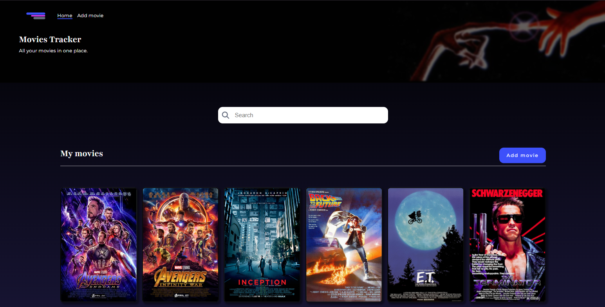
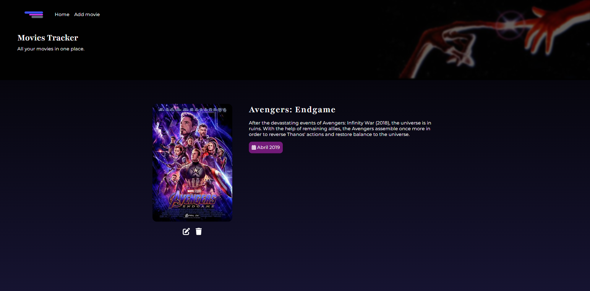

# Movies Tracker With React 
<p align="center">
  
  
</p>

## Table of Content 
* [General Info](#general-info)
* [Technologies used](#️-technologies-used)
* [To Run the Project](#to-run-the-project)
* [Features](#-features)

## General Info
"**Movies Tracker**" is a web application built with **React** and **TypeScript** that allows users to create a collection of their favorites movies. I created this project to mainly practice my skills in React and TypeScript, with focus on practicing **CRUD Operations**, **routing** using _React Router DOM_ and **data management** with _React Query_. 


## 🛠️ Technologies used 
- React 18.3.1 
- TypeScript 
- React Router Dom 6.27.0
- React Query 5.59.16 
- Json-server 0.17.4
- React-fontawesome ^0.2.2


## ⚡To run the project 
To run the project follow the steps bellow. 

1. Ensure **Node.js** is installed. To check it, run `node -v` in your terminal. 
2. Clone this repository and install the dependencies 
```
git clone https://github.com/ThaynaraLimaa/MoviesTracker.git
cd MoviesTracker

npm install 
```
3. This application uses JSON Server to mock the backend, so you need start it before running the application. In the project root directory, open a new terminal and run: 
```
npx json-server db.json
```
4. Start the development server 
```
npm run dev
```
5. To view the application, open http://localhost:5173 in your browser


## ✨ Features
- **Add a Movie**: Allows users to add new movies to their collection.
- **Edit Movies**: Users can edit movie details directly in their collection.
- **Delete Movies**: Enables users to remove movies from the collection.
- **API Error Handling**: Displays error messages when there are issues with data fetching or saving.

### To do 
- Implement movie search functionality ✔️
- Add responsive design ✔️ 
- Sorting Options
- Enhanced Form Validation


